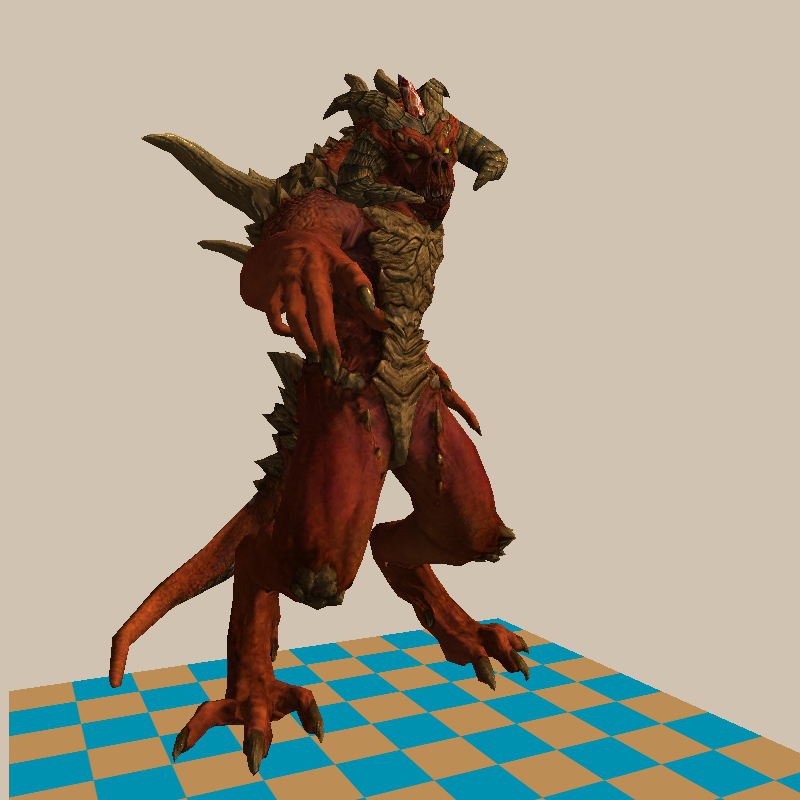
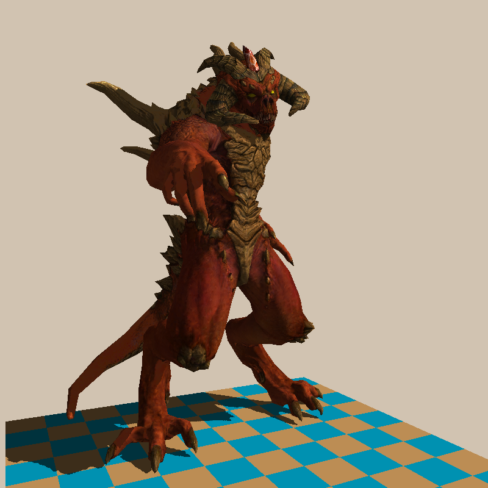
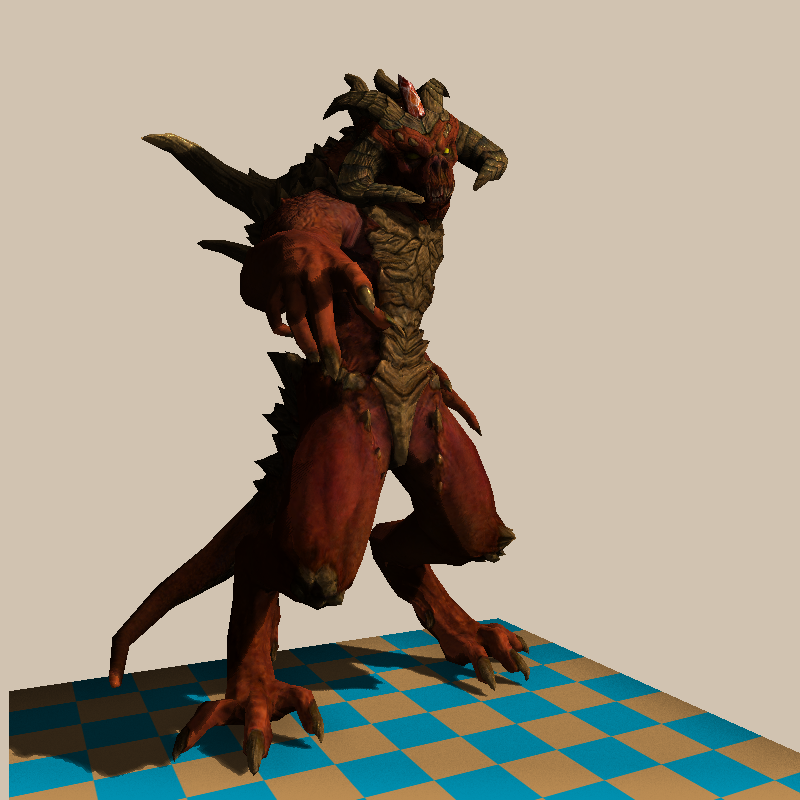

# **My Renderer** 

一个基于光栅化管线的渲染器
## **渲染样例**
 *(平行光无阴影)*
 
(平行光硬阴影)
 
(平行光阴影+ssao+双线性插值)
 
(软阴影+ssao+双线性插值)

## **功能** 

### **核心渲染管线**
- ✅ **模型加载与场景管理**  
  支持 `.obj`格式的 3D 模型导入，实现多物体场景渲染。
- ✅ **完整的光栅化流程**  
  包括模型变换（Model）、视图变换（View）、投影变换（Projection）、视口映射（Viewport），NDC与Screen。
- ✅ **顶点着色与片段着色**  
  支持逐顶点光照计算和片段级着色（Phong模型）。

### **应用的图形技术**
- **MSAA 抗锯齿（待添加）**  
  多重采样抗锯齿，平滑几何边缘锯齿。
- **阴影映射（Shadow Mapping）**  
  基于深度贴图的动态阴影，支持平行光。
- **屏幕空间环境光遮蔽（SSAO）**  
  增强场景的光照细节和深度感知。
- **双线性插值纹理过滤**  
  优化漫反射贴图的采样质量。
- **PCF 软阴影技术**  
  实现阴影抗锯齿和软阴影


## **使用说明** 

### 依赖项
- C++17 或更高版本

### 编译与运行
```bash
git clone https://github.com/Seven_486/myrenderer.git
cd myrenderer
mkdir build && cd build
cmake .. && make
./myrenderer
